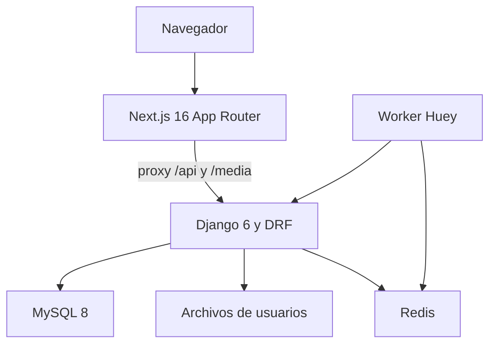
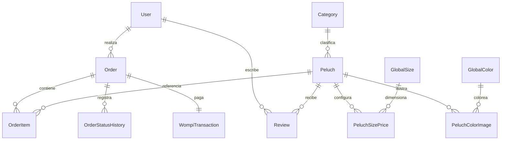

# Arquitectura — Mimittos

Revisión: 2026-10-08.

## Integridad y orden de bloqueos

Los códigos de cuenta tienen un presupuesto persistente por usuario y
propósito en `PasswordCodeAttemptBudget`: cinco fallos y cinco envíos por hora,
con sesenta segundos entre envíos. Generación y consumo bloquean primero el
usuario y después el presupuesto; ese orden también serializa su primera
creación. Reenviar invalida códigos anteriores del mismo propósito y conserva
los contadores. La vigencia sigue siendo de quince minutos.

Los escritores de pagos usan `WompiService.apply_transaction_data`: bloquean
primero `Order` y después `WompiTransaction`. Pago, pedido e historial se
guardan en la misma transacción; los callbacks de notificación se programan
con `transaction.on_commit`. Una primera aprobación válida de cualquiera de
los intentos confirma la referencia, mientras los eventos pendientes de
intentos anteriores conservan el estado actual. Una aprobación consolidada
y el progreso administrativo se preservan ante respuestas atrasadas.
`OrderService.update_status` relee el pedido bloqueado antes de decidir una
transición. Consulta y conciliación siguen este mismo contrato.

Checkout y limpieza de personalizaciones bloquean las mismas filas de medios
en orden de clave primaria. La compra relee los medios antes de crear el
pedido; la limpieza comprueba uso y ambas relaciones antes del borrado.
Si un medio ya desapareció, se solicita volver a subirlo sin pedido parcial;
si falla el almacenamiento al borrar, la fila se conserva para reintento.

Las carreras se prueban con MySQL scratch y conexiones independientes.
SQLite no acredita el comportamiento de `select_for_update`. En pruebas
transaccionales de notificaciones deben ejecutarse los callbacks del commit;
no sustituir los servicios de pedido o historial para comprobar integridad.

Referencias: `models/password_code.py`, `services/order_service.py`,
`services/wompi_service.py`, `views/payment_views.py` y
`base_feature_project/tasks.py`. Ronda: `improvement-20261008-orquestada`.

## Componentes del sistema



Next.js y Django son procesos separados. `frontend/next.config.ts` define los
rewrites de desarrollo/API; `backend/base_feature_project/urls.py` publica API,
admin y rutas condicionales de media/Silk. No existe una vista catch-all para
servir HTML de Next.js desde Django.

## Backend

```text
backend/
├── base_feature_app/
│   ├── models/                 # Entidades, reexportadas por __init__.py
│   ├── serializers/            # Contratos y validación de entradas
│   ├── views/                  # Vistas funcionales DRF
│   ├── services/               # Lógica por dominio
│   ├── urls/                   # Rutas por dominio
│   ├── management/commands/    # Seeds y datos fake
│   ├── templates/emails/       # Plantilla transaccional compartida
│   ├── utils/                  # Auth, media y render de emails
│   └── tests/
├── django_attachments/         # Library, Attachment y campos de imágenes
├── base_feature_project/
│   ├── settings.py             # Configuración común
│   ├── settings_dev.py         # Desarrollo
│   ├── settings_prod.py        # Producción
│   └── urls.py                 # API, admin y rutas condicionales
└── conftest.py                 # Fixtures pytest
```

La lógica de negocio está en servicios de pedidos, reseñas, pagos, analytics,
media, email y notificaciones. Se conserva la app de dominio única.

### Relaciones principales



`OrderItem` conserva una configuración snapshot y referencias opcionales a talla,
color y `PersonalizationMedia`, para preservar el histórico. Precios, anticipos,
descuentos por pago completo y envío se configuran por `PeluchSizePrice`.

`SiteContent` almacena JSON por key. `Blog` tiene título, descripción, categoría e
imagen, sin campos de idioma. Los modelos Product/Sale/SoldProduct y sus endpoints
backend permanecen existentes aunque la tienda actual usa Peluch.

## Frontend

Rutas públicas: inicio, catálogo, `/peluches/[slug]`, carrito, checkout, pago,
confirmación, seguimiento, blog, auth, historia, contacto y términos. `/orders`
requiere sesión y `/backoffice` concentra las vistas administrativas.

Los componentes compartidos viven en `components/admin`, `blog`, `layout` y `ui`.
`PublicChrome` coordina banner, Header y Footer. La portada compone sus secciones
y utiliza Swiper; el catálogo renderiza sus propias tarjetas.

Stores activos: `authStore`, `cartStore` y `blogStore`. Los servicios por dominio
usan `lib/services/http.ts`. No hay selector de idioma ni provider de next-intl.

```text
Página o store
  → servicio del dominio / http.ts
    → API Django
      → serializer + servicio
        → ORM + MySQL
```

El carrito se persiste localmente. La sesión almacena tokens en cookies; el
interceptor HTTP gestiona el refresco y `providers.tsx` restaura el usuario.

## API por dominio

### Privacidad de pedidos y archivos — 2026-10-02

Los archivos de personalización se autorizan mediante el uploader autenticado
real o una capacidad firmada para su ID/tipo. Upload devuelve `media_token`;
el carrito la conserva y checkout la envía por línea. Un ID antiguo sin prueba
de posesión requiere volver a subir el archivo, conservando variante y cantidad.

Tracking y las rutas de estado, información, consulta y procesamiento de pago
requieren dueño activo por `Order.customer_id`, staff activo o capacidad de ese
pedido por treinta días en `X-Order-Access`. El detalle administrativo completo
permanece limitado al dueño/staff. El número comercial y el correo declarado no
autorizan una lectura. Creación devuelve acceso al pedido recién creado.

`OrderAccessChallenge` es independiente de los códigos de cuenta. Las rutas
`orders/<number>/access/request/` y `access/verify/` solicitan y consumen un
código enviado al correo almacenado. El servicio serializa solicitudes y
verificaciones con locks por pedido, guarda hash y presupuestos persistentes.
La respuesta pública no revela si el número/correo existe. Checkout, tracking,
payment y order-confirmed comparten recuperación y conservan el carrito ante
rechazos. Correos usan `#access=`; el cliente lo guarda y retira antes de analytics.

El reemplazo de hero guarda primero el archivo nuevo, bloquea `SiteContent` al
cambiar la referencia y elimina el anterior después del commit. Fallos previos
conservan el vigente; un fallo de limpieza posterior no revierte la nueva imagen.
Las señales de correo/storage sólo incluyen operación y tipo de error.

Todas las rutas se montan bajo `/api/`; los módulos de `base_feature_app/urls/`
son la fuente de verdad de métodos y permisos.

| Dominio | Rutas representativas |
|---|---|
| Auth | sign_in, sign_up, google_login, verify_registration, token/refresh |
| Catálogo | categories, sizes, colors, peluches y galerías |
| Pedidos | orders, orders/list, orders/my, orders/track y detalle/status/tracking |
| Pagos | payment/process, payment/status, payment/check, payment/wompi/webhook |
| Reseñas | Listado por peluche y moderación |
| Analytics | Pageviews, KPIs, dashboard y exportación |
| Blog/product/sale/user | Listados y operaciones por entidad |
| Media/content/captcha | Upload, contenido por key y verificación |

Wompi informa el resultado por webhook. El navegador comprueba el estado al
volver del pago; no debe introducirse polling a Wompi.

## Despliegue

Según `vps-ops-toolkit/projects.yml`, Mimittos corre en `vps-projectapp-prod`,
dominio `mimittos.com`, rama `main` y base MySQL `mimittos_project_db`.

| Servicio | Función |
|---|---|
| `mimittos_project` | Gunicorn/Django, socket `/run/mimittos_project.sock` |
| `mimittos-frontend` | Next.js, puerto 3002 |
| `mimittos-huey` | Tareas asíncronas, Redis DB 10 |

El deploy autorizado instala dependencias y construye `.next/`, ejecuta
collectstatic y administra los servicios. El clon principal es su checkout;
las sesiones modifican worktrees propios y no migran su base enlazada.
`scripts/systemd/huey.service` es una plantilla con placeholders, no el inventario
del servicio instalado.

## Pruebas y flujos

Jest verifica páginas, componentes, stores, hooks y servicios. Playwright organiza
specs en `e2e/public`, `app`, `auth` y `backoffice`; CI utiliza dos shards.
`frontend/e2e/flow-definitions.json` conserva el contrato y
`docs/USER_FLOW_MAP.md` lo documenta. Los módulos eliminados en la limpieza de
septiembre no eran alcanzables desde las páginas; no se retiran flujos activos.

## Paginación administrativa y permisos — 2026-10-01

`GET /api/sales/` y `GET /api/orders/list/` usan la misma paginación DRF
con páginas predeterminadas y máximas de 100 registros. La respuesta contiene
`count`, `next`, `previous` y `results`; los filtros de pedidos se aplican
antes del límite. Ventas se ordena por ID descendente y pedidos por fecha
descendente con ID como desempate. Se conservan los campos de cada registro.

El cliente administrativo de pedidos recibe ese sobre y mantiene estado de
filtro/página como una sola consulta. Cambiar el filtro vuelve a página 1;
la respuesta sólo se publica mientras esa consulta siga vigente.
El listado y detalle del directorio de usuarios comprueban staff antes
de acceder a sus datos. No se cambia el modelo ni las rutas.

## Lecturas y carga de gráficos — 2026-09-30

La creación de ventas legacy resuelve los productos de cada bloque interno con
`in_bulk`, conserva las escrituras por línea y precarga las líneas con sus productos
antes de serializar la respuesta. No cambia la transacción ni el contrato del endpoint.
`blogStore` comparte una promesa sólo mientras el listado está pendiente; al terminar,
una nueva llamada consulta de nuevo, también después de un error.

El dashboard administrativo conserva KPIs, filtros y exportación en su página.
`DashboardCharts` concentra Recharts y sus transformaciones, y se importa dinámicamente
con `ssr: false` cuando los datos de analytics están disponibles. El estado de carga
sigue mostrando un mensaje mientras ese módulo se descarga.

## Elegibilidad de cuentas y códigos — 2026-10-02

El bloqueo administrativo (`is_active`) y la verificación de correo
(`email_verified`) son independientes. Una cuenta sólo obtiene, renueva o usa
una sesión si ambos valores son verdaderos; Django admin, impersonación y JWT
aplican la misma regla. `POST /api/token/` conserva su contrato access/refresh
y verifica el CAPTCHA configurado en la misma frontera que el inicio de sesión.

El registro crea una cuenta activa con correo pendiente. Los códigos distinguen
`registration` y `password_reset`; cada flujo acepta su propio propósito.
Verificación y recuperación bloquean la cuenta y el código dentro de una
transacción para impedir consumirlos dos veces. Recuperar contraseña modifica
sólo la contraseña, y nunca levanta un bloqueo administrativo.

La limpieza periódica de personalizaciones antiguas conserva la fila y la ruta
cuando falla el borrado del almacenamiento, para reintentar en la siguiente
ejecución. Registra cantidades de borrados y fallos sin nombres privados. La
carrera entre limpieza y vinculación a un pedido queda como causa independiente.
